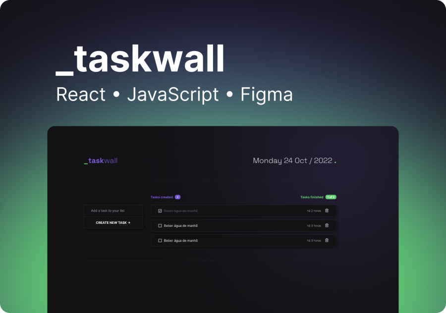

# 1. Task Wall

<p align="center">
  
</p>

This is a simple to-do list application, developed using React and JavaScript. This app was designed to make our daily tasks management experience seamless, efficient and simple.

## 2. Built With

### Node v18.12.0

### Npm 9.3.1

### JavaScript

### [Phosphor-react](https://github.com/phosphor-icons/phosphor-react)

### Figma

## 3. Design

You can find the app UI for reference trough this [link](https://www.figma.com/file/NqpfMayiAAruYJvGBUFpEG/Task-Wall?t=uwbYQpFX0fYZDNtn-6). You`ll need a Figma account to have access to the project.

## 4. Running locally in development mode

To get started, just clone the repository and run `npm install && npm run dev`.
  
```sh
gh repo clone creisbarbosa/task-wall
npm install
npm run dev
```

<p align="center">
  You're good to go!
</p>